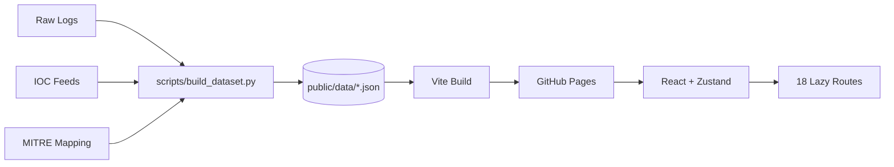

# SOC Console — Security Operations Center Simulation

[](LICENSE)
[](https://vitejs.dev/)
[](https://www.typescriptlang.org/)
[](https://tailwindcss.com/)
[](https://pages.github.com/)

> **SIEM + SOAR + EDR.** Fully static. Fully simulated.  
> A production-grade SOC dashboard built as a portfolio case study.

[🔗 Live Demo](https://yatuk.github.io/soc-simulation/) · [📊 Architecture](./docs/ARCHITECTURE.md) · [📁 Data Model](./docs/DATA_MODEL.md) · [📖 Scenarios](./docs/SCENARIOS.md)

---

## Overview

SOC Console is a **zero-backend**, **fully client-side** Security Operations Center simulation platform. It demonstrates real-world SOC workflows — alert triage, incident response, IOC intelligence, SOAR playbook orchestration, EDR endpoint monitoring, and MITRE ATT&CK mapping — across a fictional Turkish financial institution ("Anadolu Finans Holding").

All data is procedurally generated via a deterministic Python pipeline. No authentication, no API keys, no external services. Just static JSON consumed by a React SPA.

---

## Screenshots


*KPI cards, alert volume trend, severity distribution, top MITRE techniques, geo threat map.*


*Severity/status/source filters, forensic pivot links, CSV/JSON export, IOC defanging.*


*DAG-style playbook steps with automated/manual/decision indicators and run history.*

---

## Features

### SIEM — Alert Management
- **2,000+ alerts** with severity, status, source, and MITRE technique filters
- Full-text search across alert title, description, and affected entities
- **Forensic pivot navigation** — clickable IPs, users, assets, and incident links
- **AI triage summaries** — simulated Claude-generated analyst assessments per alert
- CSV/JSON export with defanged IOC output
- "Promote to Incident" workflow (simulated)

### Incident Response
- **9 incident scenarios** with full kill-chain timelines (Initial Access → Exfiltration)
- Turkish-language incident narratives (2–3 paragraphs each)
- Linked alerts, SOAR playbook runs, and threat actor matching
- **Investigation Graph** — ReactFlow-based entity relationship visualization
- Action buttons: Lock Account, Run Playbook, Close Incident

### SOAR — Playbook Orchestration
- **4 playbook definitions:** Phishing Response, Account Compromise, Malware Isolation, Data Exfiltration
- DAG-style step flow visualization with phase, owner, and success criteria
- Playbook run history with automated/manual/decision step indicators
- Parameterized commands with entity placeholder substitution

### EDR — Endpoint Detection & Response
- **140+ endpoints** filtered by type (workstation, laptop, server, mobile)
- Risk score progress bars with color-coded severity tiers
- Isolation toggle with simulated EDR actions
- Process tree (parent-child hierarchy) and network connection tables
- Per-endpoint alert history

### IOC Explorer
- **200+ indicators** across domain, IP, URL, hash, and email types
- Threat score bars with confidence indicators
- Expandable "seen where" section showing related alerts
- One-click defanged copy to clipboard
- Type-based filtering and search

### Threat Intelligence
- **Threat actor profiles** with origin, motivation, aliases, and known TTPs
- MITRE ATT&CK technique matching with overlap percentage per incident
- Notable campaigns and tool references
- Public-domain attribution data (educational use)

### MITRE ATT&CK Matrix
- Horizontal-scroll enterprise matrix (14 tactic columns × 50+ technique cards)
- Color-coded coverage heatmap with alert count badges
- Clickable technique drawers showing related alerts and detection rules
- Coverage gap analysis

### Detection Rules
- **28 Sigma-format detection rules** with unique, realistic signatures
- Source-specific detection logic (M365 audit, identity provider, endpoint EDR, email gateway)
- False positive rate and 14-day alert count per rule
- Expandable raw Sigma YAML with syntax highlighting
- Copy-to-clipboard for rule export

### User Risk Dashboard
- **84 user profiles** with risk scores, departments, roles, and risk factors
- Per-user drill-down: linked alerts, incidents, assets, event timeline
- Risk factor breakdown with rule-level scoring
- Sortable by risk score, filterable by department and role

### Case Management
- **9 detailed security cases** with owner assignment and evidence tracking
- Affected users, devices, and MITRE technique mapping per case
- Full narrative descriptions and linked alert references
- Severity and status tracking

### Log Explorer
- Raw event inspection from `events.jsonl` (200+ normalized events)
- JSON-based full-text search across all event fields
- Source type and severity filtering
- Expandable raw log view with monospace formatting

### Entity Correlation Graph
- ReactFlow-based interactive graph of user-device-IP relationships
- Color-coded node types with weighted edge connections
- Pan, zoom, and fit-view controls

### Platform Features
- **i18n:** Turkish/English language toggle with persistent setting
- **Command Palette (Ctrl+K):** Global search across alerts, incidents, IOCs, assets, and users
- **Notifications Bell:** Alert, incident, and playbook run notifications
- **Dark/Light/System theme** with CSS custom properties
- **Table density** setting (compact/normal/comfortable) persisted to localStorage
- **Pagination** on all list views
- **Per-page error boundaries** — single page crash does not take down the app
- **404 catch-all route**

### Accessibility
- Skip-to-content link
- ARIA landmark roles and labels
- Full keyboard navigation (Tab, Enter, Escape, arrow keys)
- Focus trap in dialogs and drawers
- `prefers-reduced-motion` support
- Screen reader announcements via `role="status"` live regions

---

## Quick Start

```bash
git clone https://github.com/yatuk/soc-simulation.git
cd soc-simulation/frontend
npm install
npm run dev
# → http://localhost:3000
```

**Regenerate data (optional — pre-built data is included in the repo):**

```bash
python -X utf8 scripts/build_dataset.py --seed 42 --out data/normalized/
cp data/normalized/*.json frontend/public/data/
```

**Production build:**

```bash
cd frontend
npm run build
npm run preview
```

---

## Architecture



**Data flow:** Python pipeline → static JSON files → `fetch()` → in-memory `Map` cache → Zustand stores → React components.

Full architecture document: [docs/ARCHITECTURE.md](./docs/ARCHITECTURE.md)

---

## Tech Stack

| Layer | Technology |
|-------|-----------|
| **Framework** | React 18 + TypeScript 5 (strict mode) |
| **Build** | Vite 5 |
| **Styling** | Tailwind CSS 3 + CSS custom properties (shadcn-style tokens) |
| **State** | Zustand 4 with `persist` middleware |
| **Routing** | React Router v6 (HashRouter for GitHub Pages) |
| **UI Primitives** | Radix UI (Dialog, DropdownMenu, Progress, ScrollArea, Select, Separator, Switch, Tabs, Tooltip) |
| **Charts** | Recharts 2 (Area, Bar, Pie, Line) |
| **Graph** | ReactFlow (investigation graph, correlation graph) |
| **Maps** | react-simple-maps + d3-geo |
| **Icons** | lucide-react |
| **CLI** | cmdk (command palette) |
| **Toast** | sonner |
| **Dates** | date-fns (relative time formatting) |
| **Pipeline** | Python 3.10+ (stdlib-only — zero external dependencies) |
| **CI/CD** | GitHub Actions → `actions/deploy-pages@v4` |
| **Backend** | None. Static JSON. This is a feature. |

---

## Known Limitations

- **No authentication** — everyone is "admin." This is a showcase, not a production tool.
- **No real-time streaming** — alert volume is a static snapshot. Data loads once on mount.
- **In-memory state** — simulated actions (isolate endpoint, close incident) reset on page refresh.
- **Mobile optimization** — functional but not pixel-perfect below 375px. Investigation graph requires desktop.
- **Data volume** — 2,000 alerts, ~200 events, 9 incidents. Production SIEMs handle millions.

---

## Roadmap

- [x] i18n: Turkish/English language toggle
- [x] User risk dashboard with entity drill-down
- [x] Case management module
- [x] Log explorer with raw event inspection
- [x] Entity correlation graph
- [ ] Real Sigma rule parser and validator
- [ ] STIX/TAXII feed integration (simulated)
- [ ] Incident report PDF export
- [ ] Scenario editor (create custom incidents)
- [ ] Playwright end-to-end tests
- [ ] PWA support with offline mode

---
## License

MIT. Attribution appreciated for educational and portfolio use.

**Note:** All data, companies, domains, IPs, and personas are **entirely fictional**. No connection to any real-world entity exists or is implied.
