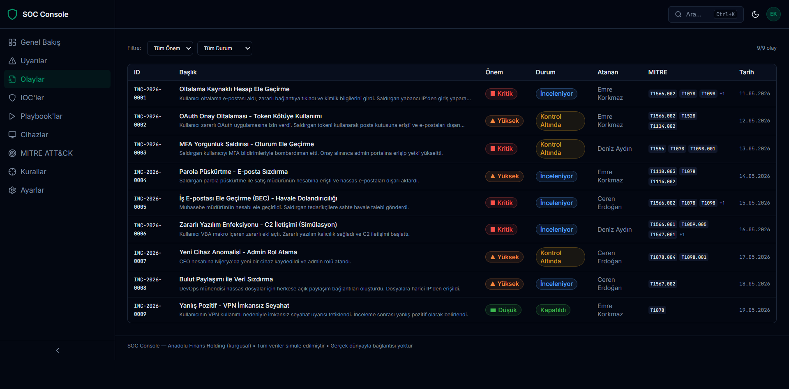
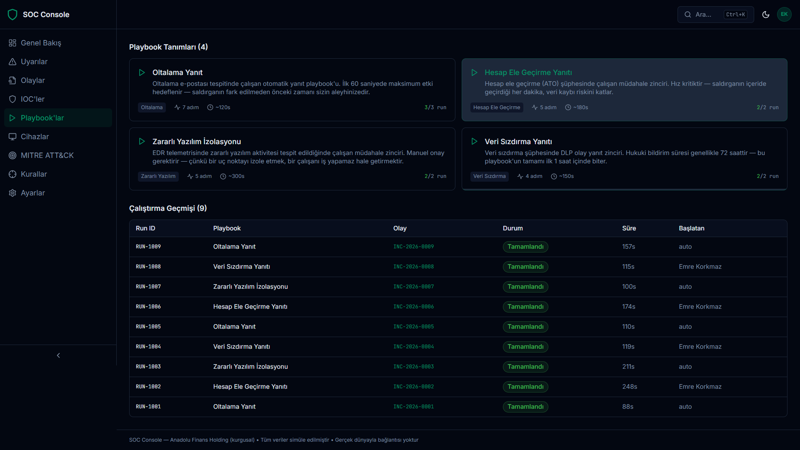
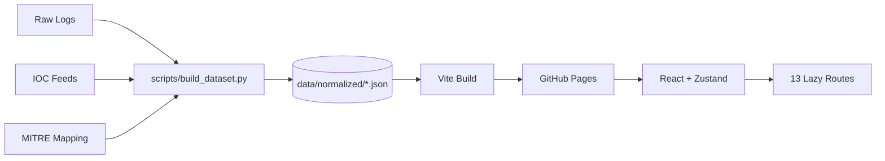

# SOC Console — Bir Güvenlik Operasyon Merkezi Simülasyonu

[](LICENSE)
[](https://vitejs.dev/)
[](https://www.typescriptlang.org/)
[](https://tailwindcss.com/)
[](https://pages.github.com/)

> SIEM + SOAR + EDR. Tamamen statik. Tamamen kurgusal.  
> 19 alert, 9 incident, 1 gerçek tehdit, 6 kahve.

[🔗 Canlı Demo](https://yatuk.github.io/SOC-case-study-project/) · [📊 Mimari](./docs/ARCHITECTURE.md) · [📁 Veri Modeli](./docs/DATA_MODEL.md) · [📖 Senaryolar](./docs/SCENARIOS.md)

---

## Ekranlar


*KPI'lar, alert trendi, severity dağılımı, top MITRE techniques.*


*Filter, search, severity breakdown, IOC defanging.*


*Playbook adımları, DAG-benzeri flow, run history.*

---

## Hikaye: Bir SOC Analistinin Günlüğü

_Tarih: Pazartesi, 09:00_
Adım Mehmet. Ben bir SOC analistiyim.

Sabah kahvemi içerken SIEM dashboard'una baktım. **4.2 milyon olay**. Güzel, dün sadece 3.8 milyondu. Gelişiyoruz.

**İlk alert:** "Suspicious PowerShell Activity Detected".
Açtım. Bir kullanıcı `Get-Process` çalıştırmış. **KRİTİK SEVİYE**. Tabii ya, adam bilgisayarında hangi programların çalıştığını merak etmiş, kesin APT29.

**İkinci alert:** "Impossible Travel - User logged in from Istanbul and Ankara within 5 minutes".
Kullanıcıyı aradım. "Abi sen nasıl 5 dakikada İstanbul'dan Ankara'ya gittin?"
"VPN kullanıyorum."
"..."
**Alert kapatıldı: False Positive - VPN**

**Üçüncü alert:** "Brute Force Attack Detected - 3 Failed Login Attempts".
Üç. Tam üç deneme. Saldırgan ya çok sabırsız ya da şifresini unutmuş bir çalışan. Spoiler: şifresini unutmuş bir çalışan.

---

_Tarih: Pazartesi, 11:30_
Müdür geldi. "Mehmet, geçen haftaki güvenlik raporunu hazırladın mı?"

Hazırladım tabii. 47 sayfa. İçinde:

- 12 sayfa "her şey yolunda"
- 15 sayfa "potansiyel tehditler" (hepsi false positive)
- 20 sayfa grafik (çünkü yöneticiler grafik seviyor)

En sevdiğim grafik: "Engellenen Saldırılar - Aylık Trend". Çubuklar yukarı gidiyor. Bu iyi bir şey mi? Daha çok saldırı engelliyoruz. Ama aynı zamanda daha çok saldırıya uğruyoruz. Schrödinger'in güvenliği.

---

_Tarih: Pazartesi, 14:00_
**Gerçek bir alert geldi.** Gerçek gerçek.

Bir kullanıcı phishing mailindeki linke tıklamış. Credential'ları çalınmış. Saldırgan mailbox'a erişmiş ve "Tüm Mailleri Dışarı Aktar" kuralı oluşturmuş.

**Klasik.**

Incident response başladı:

1. Hesabı kilitle ✓
2. Session'ları sonlandır ✓
3. Şifreyi sıfırla ✓
4. MFA'yı zorla ✓
5. Kullanıcıya "linke tıklama" eğitimi ver ✓

Kullanıcı: "Ama mail çok gerçekçi görünüyordu!"

Mail konusu: _"ACIL!!! Şifrenizi 5 dakika içinde değiştirin yoksa hesabınız silinecek - Microsoft Güvenlik Takımı (microsoft-guvenlik-takim@gmail.com)"_

Evet. Çok gerçekçi.

---

_Tarih: Pazartesi, 17:45_
Gün bitti. Scorecard'a baktım:

| Metrik | Değer |
| ------ | ----- |
| İncelenen Alert | 127 |
| Gerçek Pozitif | 1 |
| False Positive | 126 |
| Kahve Tüketimi | 6 fincan |
| Saç Kaybı | 47 tel |
| İç Çekme | 89 kez |

**MTTD (Mean Time To Detect):** 4 dakika
**MTTR (Mean Time To Respond):** 23 dakika
**MTTC (Mean Time To Coffee):** 12 dakika

---

Bu proje, o günü simüle eder. 19 alert, 9 incident, 1'i gerçek.
Mehmet yok ama olabilir. Sen.

---

## Hızlı Başlangıç

```bash
git clone https://github.com/yatuk/SOC-case-study-project.git
cd SOC-case-study-project/frontend
npm install
npm run dev
# → http://localhost:3000
```

Veri yeniden üretmek (opsiyonel — repo'da hazır veri var):

```bash
python -X utf8 scripts/build_dataset.py --seed 42 --out data/normalized/
cp data/normalized/*.json frontend/public/data/
```

Production build:

```bash
cd frontend
npm run build
npm run preview
```

---

## Ne Var Bunda?

- **SIEM:** 19 alert severity/status/source/kaynak filtreli. Search, MITRE mapping, IOC defanging. Her alert tıklanabilir, detay sayfasında bağlı IOC'ler, MITRE teknikleri, önerilen aksiyonlar.
- **Incident Management:** 9 olay, her biri kill chain timeline'lı (Initial Access → Execution → ... → Exfiltration), 2-3 paragraflık Türkçe narrative, bağlı alert'ler, SOAR playbook run linkleri. "Hesabı Kilitle", "Playbook Çalıştır", "Olayı Kapat" gibi kurgusal aksiyonlar.
- **SOAR:** 4 playbook tanımı (Oltalama Yanıt, Hesap Ele Geçirme, Zararlı Yazılım İzolasyonu, Veri Sızdırma) + run history. DAG-benzeri adım akışı, her adımda otomatik/manuel durumu.
- **EDR:** 25 endpoint, type filter (workstation/laptop/server/mobile), risk score bar, isolation toggle, process tree (parent-child), network connections.
- **IOC Explorer:** 24 IOC (domain/IP/url/hash/email), threat score bar, expandable "nerede görüldü" bölümü, defanging + copy-to-clipboard.
- **MITRE ATT&CK:** Yatay scroll matrix (14 tactic kolonu × 50+ technique kartı). Cover edilen teknik dolu renk + alert count badge. Tıklayınca drawer: ilgili alert'ler.
- **Detection Rules:** 8 Sigma kuralı, genişletilebilir ham kural görüntüleme, FP oranı, MITRE teknik etiketleri.
- **Erişilebilirlik:** Skip-to-content, landmark role'leri, keyboard navigation, focus trap, Escape tuşu, ARIA-labeled ikonlar, `prefers-reduced-motion`.
- **Sıfır Backend:** GitHub Pages'te statik. Backend yok, auth yok, API key yok. Sadece JSON + React.

---

## Mimari



Daha detaylı: [docs/ARCHITECTURE.md](./docs/ARCHITECTURE.md)

---

## Tech Stack

- **Frontend:** React 18, TypeScript, Vite 5, Tailwind CSS 3, Radix UI, Zustand, Recharts, lucide-react
- **Data Pipeline:** Python 3.10+ (stdlib-only), deterministic seed (`--seed 42`)
- **Deploy:** GitHub Actions → GitHub Pages (native `actions/deploy-pages@v4`)
- **Backend:** Yok. Hiç. Hiçbir zaman. Bu bir feature.

---

## Bilinen Sınırlamalar

- Authentication yok — herkes "admin". Çünkü kurgusal.
- Veri in-memory — sayfayı yenileyince kurgusal aksiyonlar kaybolur. Bu bir SIEM değil, bir vitrin.
- Real-time stream yok — alert volume statik snapshot.
- Mobile (<375px) optimize değil, çalışıyor ama hoş değil.
- Pipeline'da sadece 19 alert var (demo amaçlı). Prod SIEM'de bu sayı 5000+ olur.

## Roadmap (belki bir gün)

- [ ] Real Sigma rule parser
- [ ] STIX/TAXII feed integration
- [ ] Network graph view (saldırgan-asset-IOC ilişkileri)
- [ ] Senaryo edit mode (kendi incident'ını oluştur)
- [ ] PDF export (incident raporu)
- [ ] i18n: EN/TR toggle
- [ ] Playwright e2e testler

---

## Neden?

Bir portfolyo. Bir case study. Bir "SOC analisti pozisyonu için CV'mde tek bir 'modern SIEM kullandım' satırından fazlasını göstermek istedim" projesi.

Ama aynı zamanda: SOC tool'ları nasıl görünür, nasıl davranır, nasıl yanıltır — bunları başka tool'a abone olmadan anlamak isteyen herkes için.

47 sayfa rapor yerine, tıklanabilir, gezilebilir bir vitrin.

---

## Lisans

MIT. Eğitim ve portfolyo amaçlı kullanımda kaynak belirtmeniz yeterli.

**Not:** Tüm veriler, şirketler, domain'ler, IP'ler ve kişiler **tamamen kurgusaldır**. Gerçek dünyayla hiçbir bağlantısı yoktur.

> _"Daha fazla log, daha fazla güvenlik demek değil. Ama daha az uyku demek."_  
> — Her SOC Analisti
