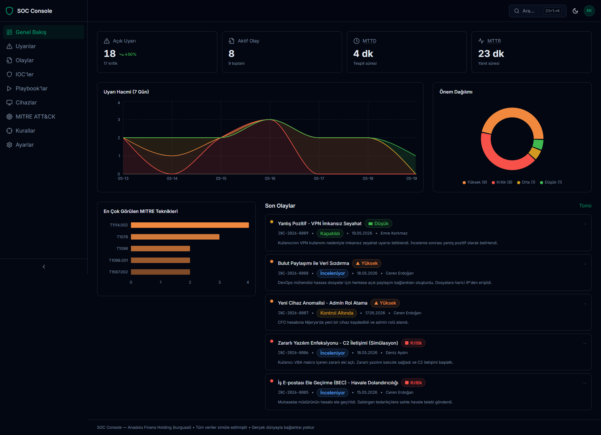
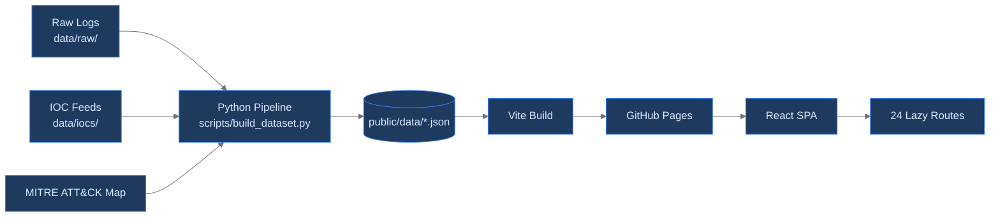

<div align="center">
  

  <h1>SOC Console</h1>

  <p><em>SIEM + SOAR + EDR — Fully Static Security Operations Center Simulation</em></p>

  <p>
    <a href="LICENSE"></a>
    <a href="CHANGELOG.md"></a>
    <a href="https://react.dev/"></a>
    <a href="https://www.typescriptlang.org/"></a>
    <a href="https://vitejs.dev/"></a>
    <a href="https://tailwindcss.com/"></a>
  </p>

  <br />

  <table>
    <tr>
      <td align="center"><strong>React 18</strong><br/><code>frontend</code></td>
      <td align="center"><strong>Python 3.10+</strong><br/><code>pipeline</code></td>
      <td align="center"><strong>Sigma</strong><br/><code>detections</code></td>
    </tr>
    <tr>
      <td align="center">Dashboard + Zustand<br/>+ Radix UI + Recharts</td>
      <td align="center">Deterministic Data Gen<br/>stdlib-only, zero deps</td>
      <td align="center">28 Rules<br/>MITRE ATT&CK mapped</td>
    </tr>
  </table>
</div>

<br />

---

## What is SOC Console?



**SOC Console** is a zero-backend, fully client-side Security Operations Center simulation built as a portfolio project. It demonstrates real-world SOC workflows — alert triage, incident response, IOC intelligence, SOAR playbook orchestration, and EDR endpoint monitoring — across a fictional Turkish financial institution.

All data is procedurally generated via a deterministic Python pipeline. No authentication, no API keys, no external services. Static JSON consumed by a React SPA deployed on GitHub Pages.

| Your need | SOC Console's answer |
|:---|---|
| Demonstrate SOC skills in a portfolio | Interactive dashboard with real analyst workflows |
| Understand SIEM/SOAR/EDR without infrastructure | Zero-backend, runs entirely in the browser |
| Showcase frontend engineering | React 18 + TypeScript strict + 24 lazy routes + i18n |
| Display security domain knowledge | MITRE ATT&CK heatmap, Sigma rules, kill-chain analysis, CVSS scoring |
| Prove data engineering capability | Deterministic Python pipeline, entity normalization, pseudonymization |

> **SOC Console is a simulation.** All alerts, incidents, IOCs, users, and assets are fictional. No connection to any real-world entity exists.

---

## Architecture



```
┌──────────────────────┐     ┌───────────────────┐     ┌──────────────────┐
│   Python Pipeline    │     │   Static JSON      │     │   React SPA       │
│                      │     │                    │     │                    │
│  build_dataset.py ───┼────►│  public/data/*.json│────►│  fetch() → cache   │
│  generate_incidents   │     │                    │     │  Zustand stores   │
│  extract_iocs        │     │  alerts.json       │     │  Lazy routes      │
│  enrich_mitre        │     │  incidents.json    │     │  Tailwind + Radix │
│  normalize           │     │  iocs.json         │     │  Recharts + ReactFlow │
│  pseudonymize        │     │  vulnerabilities   │     │                    │
│                      │     │  ...17 files       │     │                    │
│  stdlib-only, 0 deps │     │                    │     │                    │
└──────────────────────┘     └───────────────────┘     └──────────────────┘
```

Full architecture document: [docs/ARCHITECTURE.md](docs/ARCHITECTURE.md) · Data model: [docs/DATA_MODEL.md](docs/DATA_MODEL.md)

---

## Quick Start

```bash
git clone https://github.com/yatuk/soc-simulation.git
cd soc-simulation/frontend
npm install
npm run dev
# → http://localhost:5173/soc-simulation/
```

**Regenerate data (optional — pre-built data is included):**

```bash
python -X utf8 scripts/build_dataset.py --seed 42 --out data/normalized/
cp data/normalized/*.json frontend/public/data/
```

**Production build:**

```bash
cd frontend
npm run build    # TypeScript → Vite → dist/
npm run preview  # Local production preview
```

> **Live demo:** [yatuk.github.io/soc-simulation](https://yatuk.github.io/soc-simulation) — deployed via GitHub Actions on every push to `main`.

---

## Features

### SIEM — Alert Management

| Capability | Detail |
|---|---|
| Alert volume | 2,000+ alerts, 9 incident scenarios, risk-scored & prioritized |
| Filtering | Severity, status, source, full-text search, URL-param persisted |
| Forensic pivot | Clickable IPs, users, assets, incident links |
| AI triage | Simulated Claude-generated analyst summaries |
| Export | CSV/JSON with defanged IOC output |
| Triage workflow | Investigate → Escalate → Close with toast feedback |

### Incident Response

| Capability | Detail |
|---|---|
| Incidents | 9 scenarios with full kill-chain timelines |
| Narrative | Turkish-language 2–3 paragraph descriptions |
| Linked entities | Alerts, SOAR playbook runs, threat actors |
| Investigation graph | ReactFlow-based entity relationship visualization |
| Actions | Lock Account, Run Playbook, Close Incident (simulated) |

### SOAR — Playbook Orchestration

| Capability | Detail |
|---|---|
| Definitions | 4 playbooks: Phishing, Account Compromise, Malware, Exfiltration |
| Step flow | DAG-style visualization with phase, owner, success criteria |
| Run history | Automated/manual/decision step indicators |
| Parameterization | Entity placeholder substitution in commands |

### EDR — Endpoint Detection & Response

| Capability | Detail |
|---|---|
| Endpoints | 140+ assets (workstation, laptop, server, mobile) |
| Risk scoring | Color-coded progress bars with severity tiers |
| Process tree | Parent-child hierarchy per endpoint |
| Network | Connection tables with protocol and port |
| Actions | Isolate/Restore (simulated EDR actions) |

### Threat Intelligence

| Capability | Detail |
|---|---|
| IOC Explorer | 200+ indicators (domain, IP, URL, hash, email) |
| Threat actors | Profiles with origin, motivation, aliases, TTPs |
| MITRE ATT&CK | Navigator-style heatmap: grid + treemap, 14 tactics × 50+ techniques |
| Detection rules | 28 Sigma-format rules with unique signatures |
| Correlation graph | 7 node kinds, filter toggles, MiniMap, detail sidebar |

### Vulnerability Management

| Capability | Detail |
|---|---|
| CVSS scoring | 15+ CVE records with CVSS 3.1 vectors and score gauges |
| Severity filter | Critical / High / Medium / Low tabs with counts |
| Vector breakdown | Attack Vector, Complexity, Privileges, Scope, Impact metrics |
| Remediation | Per-vulnerability fix instructions with asset linking |
| Status tracking | Open / In Progress / Remediated / Accepted Risk |

### Data Management

| Capability | Detail |
|---|---|
| User risk dashboard | 84 profiles with risk scores, departments, factors |
| Case management | 9 cases with owner, evidence, MITRE mapping |
| Log explorer | Raw event inspection with JSON search and filters |
| Entity drill-down | Per-user alerts, incidents, assets |

### Platform

| Capability | Detail |
|---|---|
| i18n | Turkish/English toggle, persisted setting |
| Command palette | Ctrl+K global search across all entities |
| Theme | Dark / Light / System with CSS custom properties |
| Accessibility | Skip-to-content, ARIA landmarks, full keyboard nav |
| Resilience | Per-page error boundaries, 404 catch-all route |
| Notifications | Alert, incident, and playbook run bell |

---

## Dashboard Visualizations

| Visualization | Chart Type | Library |
|---|---|---|
| **Alert volume timeline** | Stacked area (7d) / Bar (30d/60d) with time range selector | Recharts |
| **Event volume trend** | Line chart, 60-day | Recharts |
| **Severity distribution** | Sunburst (hierarchical) + Donut (side-by-side) | Recharts v3 |
| **MITRE ATT&CK coverage** | Grid heatmap (desktop) + Treemap (alternative) | Recharts v3 |
| **Top MITRE techniques** | Horizontal bar chart, top 5 | Recharts |
| **Threat origin map** | Equal Earth projection, markers + attack flow lines | react-simple-maps |
| **Entity correlation graph** | Node-edge graph, 7 entity kinds, filter toggles | ReactFlow |
| **KPI cards** | 8 metric cards with deltas and sparklines | Pure CSS |

---

## Tech Stack

<table>
  <tr>
    <th>Layer</th>
    <th>Technology</th>
  </tr>
  <tr>
    <td><strong>Framework</strong></td>
    <td>
      
      
      
    </td>
  </tr>
  <tr>
    <td><strong>Styling</strong></td>
    <td>
      
      &nbsp; Custom CSS properties (shadcn-style tokens)
    </td>
  </tr>
  <tr>
    <td><strong>State & Routing</strong></td>
    <td>
      Zustand 4 (persist middleware) · React Router v6 (HashRouter)
    </td>
  </tr>
  <tr>
    <td><strong>UI Primitives</strong></td>
    <td>
      Radix UI (Dialog, DropdownMenu, ScrollArea, Select, Switch, Tabs, Tooltip)
    </td>
  </tr>
  <tr>
    <td><strong>Charts & Graphs</strong></td>
    <td>
      Recharts 3.8 (Area, Bar, Pie, Treemap, Sunburst) · ReactFlow 11 · react-simple-maps 3
    </td>
  </tr>
  <tr>
    <td><strong>Utilities</strong></td>
    <td>
      lucide-react (icons) · cmdk (command palette) · sonner (toast) · date-fns (relative time)
    </td>
  </tr>
  <tr>
    <td><strong>Data Pipeline</strong></td>
    <td>
      
      &nbsp; stdlib-only, zero external dependencies, deterministic seed
    </td>
  </tr>
  <tr>
    <td><strong>CI/CD</strong></td>
    <td>
      
      &nbsp; deploy-pages@v4 → GitHub Pages
    </td>
  </tr>
</table>

---

## Data Pipeline

```
┌─────────────────────────────────────────────────────────────┐
│                 scripts/build_dataset.py                     │
│                                                              │
│  ┌──────────────────┐  ┌──────────────┐  ┌───────────────┐ │
│  │ generate_incidents│  │ extract_iocs │  │ enrich_mitre  │ │
│  │ 9 scenarios       │  │ 200+ IOCs    │  │ MITRE coverage│ │
│  │ 2000+ alerts      │  │ 5 types      │  │ 50+ techniques│ │
│  └────────┬─────────┘  └──────┬───────┘  └───────┬───────┘ │
│           │                   │                    │         │
│           └───────────────────┼────────────────────┘         │
│                               ▼                              │
│                    ┌──────────────────┐                      │
│                    │    normalize     │                      │
│                    │  entity profiles │                      │
│                    │  KPI metrics     │                      │
│                    └────────┬─────────┘                      │
│                             │                                │
│                    ┌────────▼─────────┐                      │
│                    │  pseudonymize    │                      │
│                    │  ID generation   │                      │
│                    └──────────────────┘                      │
└─────────────────────────────────────────────────────────────┘
                             │
                             ▼
              ┌──────────────────────────┐
              │  frontend/public/data/    │
              │  17 JSON files            │
              │  consumed by React SPA    │
              └──────────────────────────┘
```

| Script | Output | Records |
|--------|--------|---------|
| `generate_incidents.py` | alerts, incidents, playbook_runs, playbook_definitions, detection_rules | 2000+ / 9 / 12 / 4 / 28 |
| `extract_iocs.py` | IOCs (domain, IP, URL, hash, email) | 200+ |
| `enrich_mitre.py` | MITRE ATT&CK coverage matrix | 50+ techniques |
| `normalize.py` | Entities (users, assets), KPI metrics | 84 / 140+ |
| `pseudonymize.py` | Deterministic ID generation | — |

---

## Page Routes

| Route | Page | Data Source |
|-------|------|-------------|
| `/` | Overview Dashboard | `kpi_metrics.json`, `threat_origins.json` |
| `/alerts` | Alert list (risk-scored, triage) | `alerts.json` |
| `/alerts/:id` | Alert detail + AI summary | `alerts.json`, `ai_summaries.json` |
| `/incidents` | Incident list | `incidents.json` |
| `/incidents/:id` | Incident detail + investigation graph | `incidents.json`, `playbook_runs.json` |
| `/iocs` | IOC Explorer | `iocs.json` |
| `/playbooks` | SOAR playbook definitions + runs | `playbook_definitions.json`, `playbook_runs.json` |
| `/playbooks/:id` | Playbook detail with step flow | `playbook_definitions.json` |
| `/endpoints` | EDR endpoint list | `assets.json` |
| `/endpoints/:id` | Endpoint detail + process tree | `assets.json`, `users.json` |
| `/mitre` | MITRE ATT&CK heatmap | `mitre_coverage.json` |
| `/detections` | Sigma detection rules | `detection_rules.json` |
| `/threat-actors` | Threat actor profiles | `threat_actors.json` |
| `/threat-actors/:id` | Actor detail + TTP matching | `threat_actors.json` |
| `/vulnerabilities` | CVSS-prioritized vulnerability list | `vulnerabilities.json` |
| `/vulnerabilities/:id` | CVE detail + vector breakdown | `vulnerabilities.json` |
| `/users` | User risk dashboard | `users.json` |
| `/users/:id` | User detail (alerts, assets, risk) | `users.json`, `alerts.json`, `assets.json` |
| `/cases` | Case management | `cases.json` |
| `/cases/:id` | Case detail (narrative, MITRE) | `cases.json` |
| `/logs` | Log Explorer (raw events) | `events.jsonl` |
| `/correlations` | Entity correlation graph | `correlations.json` |
| `/settings` | Theme, language, table density | localStorage (persisted) |
| `*` | 404 Not Found | — |

All 24 routes are lazy-loaded with per-route error boundaries.

---

## Configuration

<details>
<summary><strong>Settings (persisted to localStorage)</strong></summary>

| Setting | Values | Default |
|---------|--------|---------|
| Theme | `dark` / `light` / `system` | `dark` |
| Language | `tr` / `en` | `tr` |
| Table density | `compact` / `normal` / `comfortable` | `normal` |
| Sidebar | `expanded` / `collapsed` | `expanded` |

</details>

<details>
<summary><strong>Environment variables (Vite)</strong></summary>

| Variable | Default | Description |
|----------|---------|-------------|
| `VITE_BASE_PATH` | `/soc-simulation/` | GitHub Pages subpath |

</details>

---

## Repository Layout

```
soc-simulation/
├── frontend/                React SPA
│   ├── src/
│   │   ├── i18n/            tr.json + en.json translation files
│   │   ├── components/
│   │   │   ├── ui/          15+ primitives (Badge, Card, Tabs, etc.)
│   │   │   ├── layout/      Sidebar, Topbar, NotificationsBell
│   │   │   └── features/    Domain components (charts, command palette)
│   │   ├── pages/           24 lazy-loaded route pages
│   │   ├── store/           12 Zustand stores (factory pattern)
│   │   ├── lib/             data fetching, utilities, formatters
│   │   ├── hooks/           useTheme, useTableDensity
│   │   └── types/           Canonical TypeScript interfaces
│   ├── public/data/         17 pre-built JSON data files
│   └── tailwind.config.js   Type scale, severity/status colors, animations
├── scripts/                 Python data pipeline (stdlib-only)
│   ├── build_dataset.py     Main orchestrator
│   ├── generate_incidents.py
│   ├── extract_iocs.py
│   ├── enrich_mitre.py
│   ├── normalize.py
│   ├── pseudonymize.py
│   └── _data.py             Shared constants (users, assets, MITRE)
├── src/                     Legacy pipeline modules (normalization, scoring)
├── data/                    Raw logs, IOC feeds, normalized output
├── detections/              Sigma YAML rules + investigation queries
└── docs/                    Architecture, data model, scenarios, screenshots
```

---

## Development

```bash
# Frontend
cd frontend
npm run dev       # Dev server (http://localhost:5173/soc-simulation/)
npm run build     # TypeScript → Vite → dist/
npx tsc --noEmit  # TypeScript tip kontrolü

# Data pipeline
python scripts/build_dataset.py     # Veri pipeline'ını çalıştır
python -X utf8 scripts/build_dataset.py --seed 42

# Lint
cd frontend && npm run lint
```

---

## Known Limitations

| Limitation | Detail |
|---|---|
| No authentication | Everyone is "admin" — this is a showcase, not a production tool |
| No real-time streaming | Alert volume is a static snapshot; data loads once on mount |
| In-memory state | Simulated actions reset on page refresh |
| Mobile | Functional but not pixel-perfect below 375px; investigation graph requires desktop |
| Data volume | 2,000 alerts, ~200 events, 9 incidents — production SIEMs handle millions |

---

## Roadmap

| Status | Feature |
|--------|---------|
| ✅ | i18n: Turkish/English language toggle |
| ✅ | User risk dashboard with entity drill-down |
| ✅ | Case management module |
| ✅ | Log explorer with raw event inspection |
| ✅ | Entity correlation graph (7 node kinds, filter toggles) |
| ✅ | Per-page error boundaries |
| ✅ | Shimmer skeleton loading animations |
| ✅ | MITRE ATT&CK Navigator-style heatmap (grid + treemap) |
| ✅ | CVSS vulnerability management section |
| ✅ | Time series trends with range selector (24h/7d/30d/60d) |
| ✅ | Alert risk scoring + triage workflow |
| ✅ | Severity sunburst chart (Recharts v3) |
| ✅ | Enhanced threat map with attack flow lines |
| ☐ | RBAC: role-based views (CISO / SOC Analyst) |
| ☐ | Compliance: ISO 27001, NIST CSF, SOC 2 coverage |
| ☐ | Real Sigma rule parser and validator |
| ☐ | STIX/TAXII feed integration (simulated) |
| ☐ | Incident report PDF export |
| ☐ | Playwright end-to-end tests |
| ☐ | PWA support with offline mode |

---

## Contributing

This is a personal portfolio project, not actively seeking open contributions. However:

- **Bug found?** Open an issue with a screenshot.
- **Scenario suggestion?** Open an issue with MITRE technique references.
- **Fork it?** MIT license — go ahead.

Conventional Commits: `feat:`, `fix:`, `docs:`, `refactor:`, `chore:`

---

## License

MIT. All data, companies, domains, IPs, and personas are entirely fictional. No connection to any real-world entity exists or is implied.

---

## Built With

SOC Console stands on the shoulders of open-source projects:

| Project | Role |
|---------|------|
| [React](https://react.dev) | UI framework |
| [TypeScript](https://www.typescriptlang.org) | Type safety |
| [Vite](https://vitejs.dev) | Build tool |
| [Tailwind CSS](https://tailwindcss.com) | Utility-first CSS |
| [Radix UI](https://www.radix-ui.com) | Accessible headless primitives |
| [Recharts](https://recharts.org) | Charting library (v3) |
| [ReactFlow](https://reactflow.dev) | Node-edge graph visualization |
| [react-simple-maps](https://www.react-simple-maps.io) | Geographic map |
| [Zustand](https://zustand-demo.pmnd.rs) | State management |
| [Lucide](https://lucide.dev) | Icon set |
| [Sonner](https://sonner.emilkowal.ski) | Toast notifications |
| [date-fns](https://date-fns.org) | Date formatting |
| [cmdk](https://cmdk.paco.me) | Command palette |

---

## ⭐ Show Your Support

If this project helped you understand SOC workflows or served as a portfolio reference, please star the repo — it keeps the maintainers motivated.

[](https://github.com/yatuk/soc-simulation/stargazers)

---

## Links

| Resource | URL |
|---|---|
| **Live Demo** | [yatuk.github.io/soc-simulation](https://yatuk.github.io/soc-simulation) |
| **Architecture** | [docs/ARCHITECTURE.md](docs/ARCHITECTURE.md) |
| **Data Model** | [docs/DATA_MODEL.md](docs/DATA_MODEL.md) |
| **Changelog** | [CHANGELOG.md](CHANGELOG.md) |

<br />

<div align="center">
  <sub>Built by <a href="https://github.com/yatuk">yatuk</a> · <a href="https://github.com/yatuk/soc-simulation">GitHub</a></sub>
</div>
